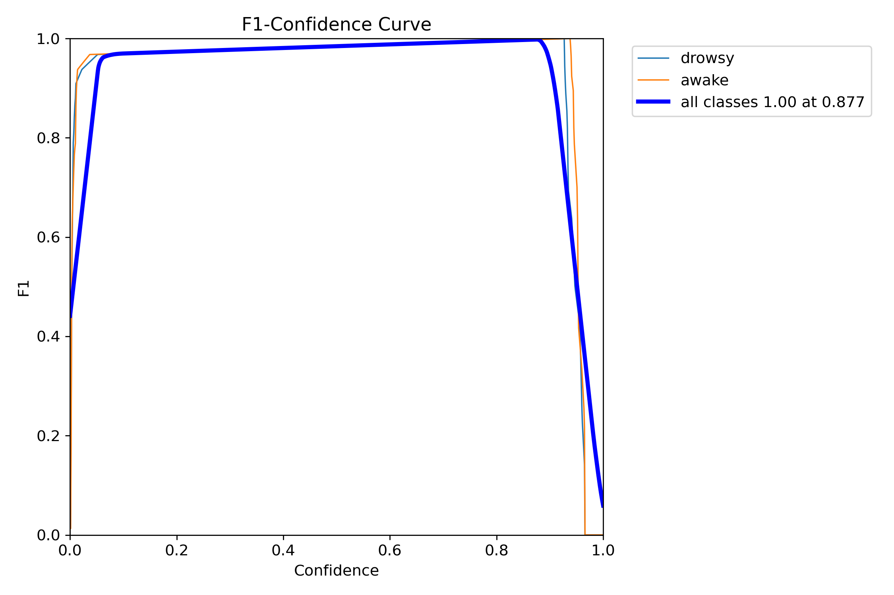
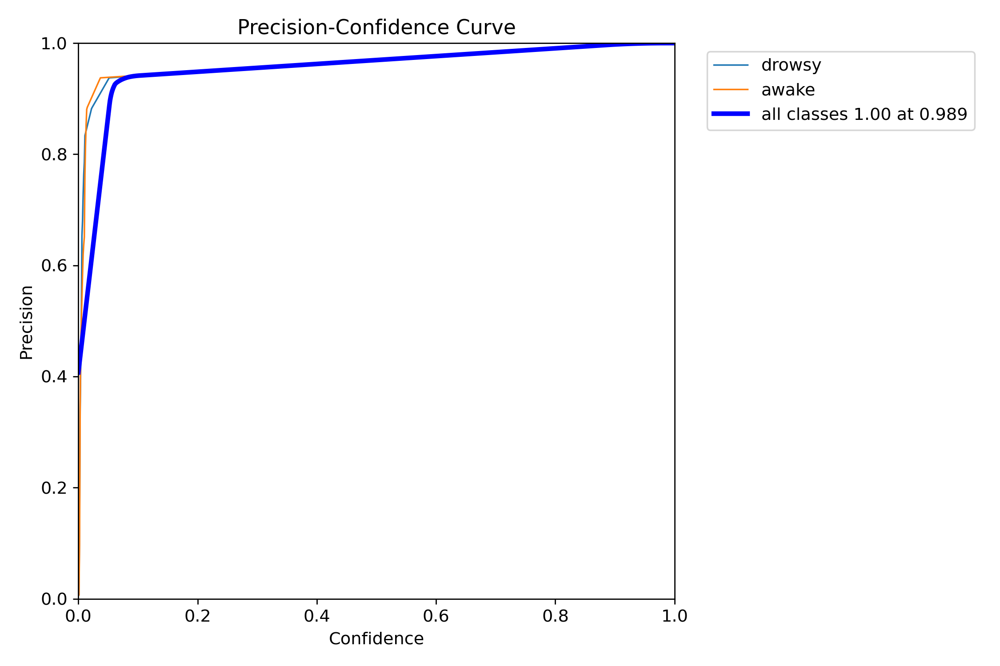
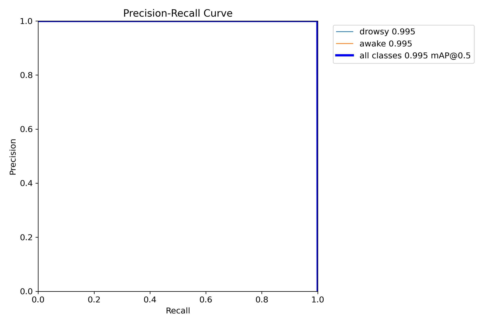
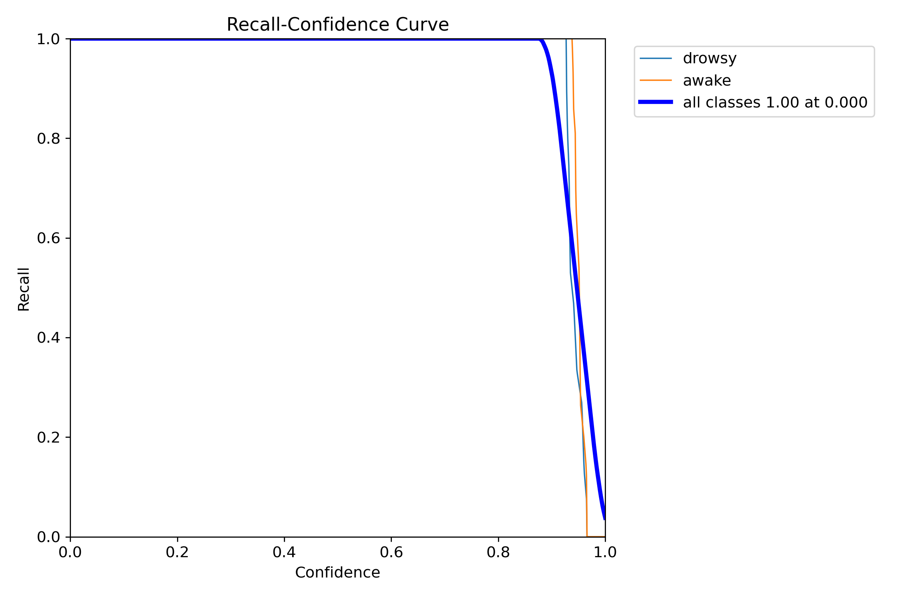
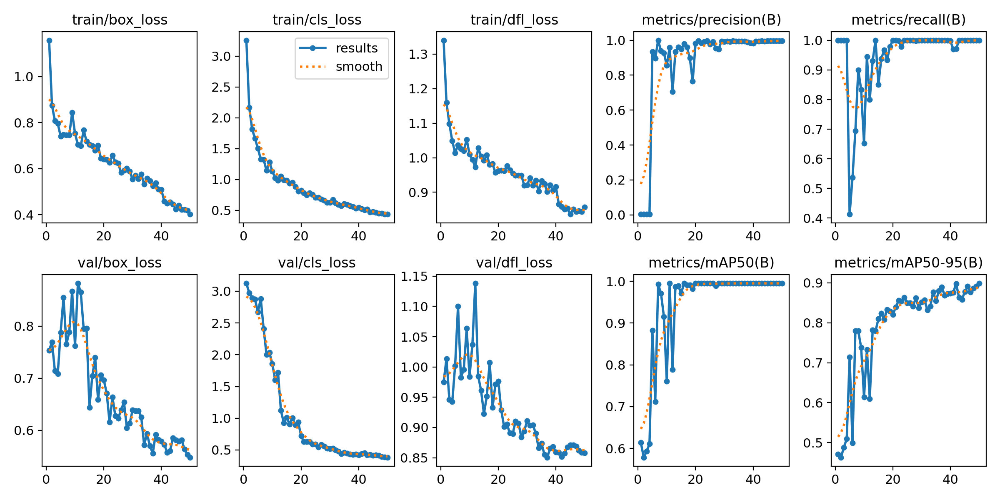
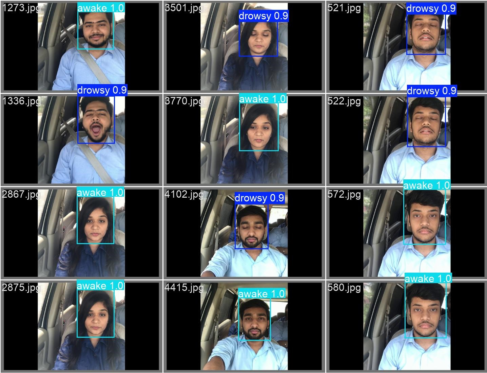

# 😴 Drowsiness Detection using YOLOv11


A computer vision project to detect **drowsiness vs. awake** states using a custom-trained [YOLOv11](https://github.com/ultralytics/ultralytics) model.

---

## 📌 Project Overview

| **Key Element**   | **Description**                                           |
| ----------------- | --------------------------------------------------------- |
| **Model**         | YOLOv11n (Ultralytics) – object detection                 |
| **Classes**       | `awake`, `drowsy`                                          |
| **Data Type**     | Annotated face images                                     |
| **Demo**          | Hugging Face (image/video)                                |
| **Fine-Tuning**   | Scripted (fine-tuning · augmentation)                           |
| **Evaluation**    | mAP@0.5:0.95 = 89.8% · mAP@0.5 = 99.5%                     |
| **Dataset Split** | (Train / Val / Test) 190 / 30 / 20 images              |

---


## 📦 What's Inside

* **Jupyter Notebook** — includes training code and drowsiness detection with consecutive-frame confirmation
* **Local testing script (`drowsiness-detection.py`)** — supports image, video, and real-time webcam inference
* **Custom fine-tuning** — adapt the model to your dataset with optional augmentation
* **Hugging Face demo** — instant online testing without local setup

---

## 🧠 Summary

This project uses a custom-trained YOLOv11 object detection model to classify face states as `awake` or `drowsy`. The system can run on real-time webcam, videos, or single images. Fine-tuning with your own data is supported, along with optional data augmentation.

> **Note:** Includes optional video mode with consecutive-frame confirmation to reduce false positives.


---

## 🧪 Evaluation

| Metric    | Value                   |
| --------- | ----------------------- |
| Precision  | 99.6%                  |
| Recall | 100% |
| F1 Score    | 99.8% |
| mAP@0.5  | 99.5%  |
| mAP@0.5:0.95  | 89.8%  |

### **Evaluation Graphs**

| F1-Confidence Curve          | Precision-Confidence Curve |
| ---------------------------- | -------------------------- |
|  |  |

| Precision-Recall Curve       | Recall-Confidence Curve    |
| ---------------------------- | -------------------------- |
|  |  |

<!-- ### **Confusion Matrix**

 -->

<!-- > The confusion matrix shows minimal misclassification between `drowsy` and `awake`. -->

### **Training Metrics**



---
|  |  |
|---------------------------------------------------|----------------------------------------------------|


---

## 🖥️ Online Demo

Try it live:
👉 [Hugging Face Demo](https://huggingface.co/spaces/amin704/drowsiness-detection-demo)

> Upload image/video

---

## 🎥 Local Inference

```bash
python drowsiness-detection.py
```

**Modes available:**

| Input Type | Description                                                |
| ---------- | ---------------------------------------------------------- |
| `1`        | Webcam detection (ESC to close)                            |
| `2`        | Detect on image (`Enter image path`, optional save output) |
| `3`        | Detect on video (`Enter video path`, optional save output) |

**Sample Prompt:**

```
Enter choice (1/2/3): 2
Enter image path: media/sample.jpg
Save output? (y/n): y
Enter output file path (default: output.jpg):
```

---
## 📹 Additional Video Processing Logic

In video mode, the system uses temporal filtering to reduce false positives. A drowsiness alert is only triggered when the 'drowsy' class is detected in several consecutive frames, a logic implemented within the training notebook."


**Demo (filtered video output):** 


---

## 🔁 Fine-Tuning with Your Dataset

### 1. Folder Structure

```
fine_tune/
├── fine_tune.py
├── augmentation.py
├── dataset.yaml
├── drowsiness_detection.pt
├── requirements.txt
└── data/
    ├── images/
    │   ├── train/
    │   └── val/
    └── labels/
        ├── train/
        └── val/
```

### 2. Sample `data.yaml`

```yaml
train: data/images/train
val: data/images/val

nc: 2
names: ["drowsy", "awake"]
```

### 3. Data Augmentation (Optional)

```bash
python fine_tune/augmentation.py
```

> Augmented data will be saved in `train/augmented/` — **move its contents into the main `train/` folder**.

### 4. Train the Model

```bash
cd fine_tune
pip install -r requirements.txt
python fine_tune.py
```

---

## 📂 Project Structure

```


drowsiness-detection/
├── train.ipynb                # Training notebook
├── drowsiness-detection.py    # Main inference script
├── dataset.yaml               # YOLO dataset config
├── requirements.txt           # Main dependencies
├── drowsiness_detection.pt    # Main trained model
├── yolo11n.pt                 # YOLO base model
├── results/                   # Training results (metrics, curves)
└── fine_tune/                # Fine-tuning scripts and configs
   ├── fine_tune.py
   ├── augmentation.py
   ├── drowsiness_detection.pt
   ├── requirements.txt       # Fine-tuning dependencies
   ├── data.yaml               # Dataset config for fine-tune
   └── data/
      ├── images/
      │   ├── train/
      │   └── val/
      └── labels/
          ├── train/
          └── val/

```


---

## تشخیص خواب‌آلودگی

این پروژه برای شناسایی وضعیت خواب‌آلودگی با استفاده از مدل YOLOv11 آموزش داده شده است. امکان اجرا بر روی وب‌کم، ویدیو و تصویر وجود دارد و می‌توان آن را با داده‌های جدید بازآموزی کرد. دموی آنلاین در Hugging Face ارائه شده است.

---

